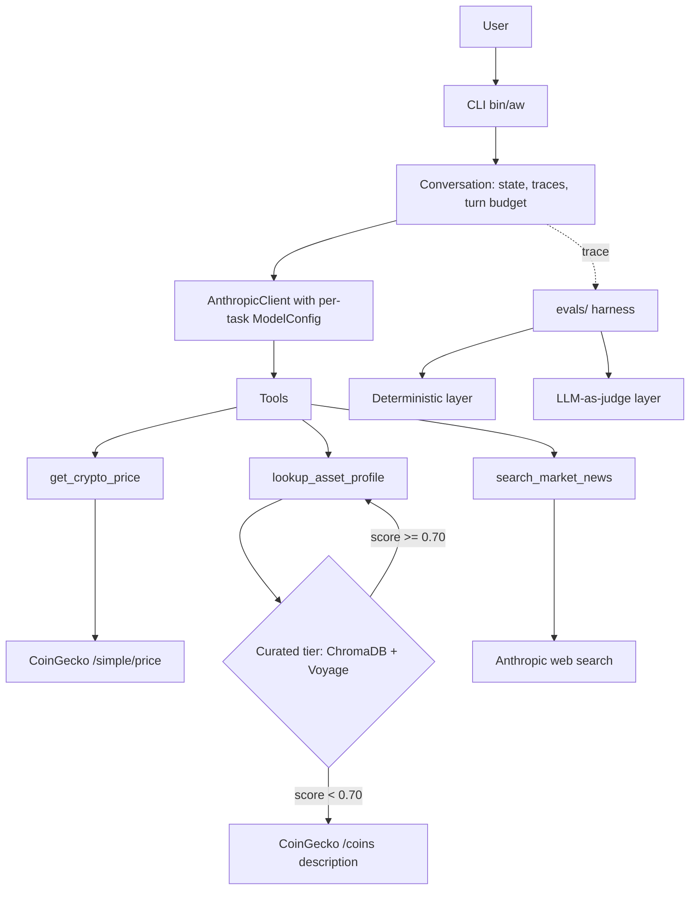

# AW Analysis

Cross-asset market intelligence agent. Ask questions about markets in plain
English; the agent selects appropriate data sources, calls them, and answers
with explicit attribution.

Built as a portfolio piece, applying patterns from an 8-module AI Systems
Engineering programme (see [axwxtson/ai-systems-engineering](https://github.com/axwxtson/ai-systems-engineering)).

## Status

**Stage 6 of 8 — Evaluation & Testing.** Each stage
layers in patterns from one study module:

| Stage | Module | What it adds |
|-------|--------|--------------|
| 1 | LLM API Engineering | Anthropic SDK wrapper, tool definitions, agent loop |
| 2 | Prompt Engineering | Structured system prompt with versioning, few-shot examples |
| 3 | Agent Architectures | Stateful Conversation with cross-turn memory, structured traces |
| 4 | RAG Systems | Embedding pipeline, vector store, tiered retrieval |
| 5 | LLM Fundamentals | Per-task ModelConfig, token accounting, soft context budget |
| 6 | Evaluation & Testing | Two-layer eval harness with calibrated LLM judge (current) |
| 7–8 | Coming | Multi-model orchestration, observability |

## What it does today

The agent answers crypto market questions using three retrieval modalities,
choosing dynamically based on the query:

- **`get_crypto_price`** — live price, 24h change, market cap, and volume
  via CoinGecko. Works for any asset CoinGecko tracks.
- **`lookup_asset_profile`** — background information about an asset.
  Tiered retrieval: tries a curated RAG corpus first; falls back to
  CoinGecko's description endpoint when there's no curated profile.
- **No tool** — for follow-ups answerable from conversation history,
  or general crypto concepts.

The asset profile tool returns a `source` field in its results
(`"curated"`, `"coingecko"`, or `"none"`), and the agent attributes
provenance accordingly — "from our research" vs. "according to CoinGecko"
— rather than presenting all sources as equivalent.

## How we know it works

The agent ships with an automated eval harness in `evals/`. Two layers
grade every case in parallel:

- **Deterministic** — assertions against the per-iteration trace fields
  the agent emits (`was_refusal`, `tool_calls`, iteration count, token
  usage). Fast, reproducible, brittle to paraphrase by design.
- **LLM-as-judge** — faithfulness and relevance scoring of the final
  answer against the tool results captured in the trace. Calibrated
  against a 12-pair human-graded reference set; bias-tested for
  position and length effects.

The judge is calibrated before any eval run gates on its scores. The
calibration pass measures exact agreement, ±1 agreement, direction
agreement, position consistency, and length bias against five
explicit thresholds.

Golden dataset: 24 cases across six query classes (price, profile via
curated retrieval, profile via CoinGecko fallback, news, refusal,
combined-tools). Every case has an explicit rationale.

```bash
# Calibrate the judge (required once per rubric version)
PYTHONPATH=$(pwd) python -m evals.cli calibrate

# Run the full harness against the active prompt
PYTHONPATH=$(pwd) python -m evals.cli run

# Compare two runs (baseline vs candidate)
PYTHONPATH=$(pwd) python -m evals.cli compare \
  evals/results/2.2.0_<run_id>.json \
  evals/results/2.3.0-broken_<run_id>.json
```

## Architecture



## Components

- **`aw_analysis/agent/`** — `Conversation` (stateful), `TurnTrace`,
  `ToolCall`, agent loop, error types
- **`aw_analysis/client/`** — Anthropic SDK wrapper
- **`aw_analysis/tools/`** — three tools (`get_crypto_price`,
  `lookup_asset_profile`, `search_market_news`) with schemas, descriptions,
  and structured `ToolResult` returns; `default_registry()` constructs
  the standard registry used by both the CLI and the eval harness
- **`aw_analysis/data_sources/`** — plain HTTP clients (CoinGecko)
- **`aw_analysis/rag/`** — chunker (per-section markdown), embedder
  (Voyage AI, asymmetric query/document), vector store (ChromaDB,
  cosine), retriever, ingest pipeline
- **`aw_analysis/prompts/`** — six-section system prompt, version
  registry, few-shot examples
- **`data/asset_profiles/`** — 10 hand-written markdown profiles
  (one per researched asset)
- **`data/chroma/`** — generated vector store (gitignored)
- **`bin/aw`** — shell wrapper invoking `python -m aw_analysis.cli.main`
- **`aw_analysis/config/`** — runtime settings, per-task `ModelConfig`
  with measured temperature/max-token defaults, `TaskType` enum
- **`evals/`** — automated eval harness (golden dataset, two-layer
  grader, judge calibration, A/B regression)

## Setup

```bash
git clone https://github.com/axwxtson/AWAnalysis.git
cd AWAnalysis
python3 -m venv .venv
source .venv/bin/activate
pip install -e .

# Configure environment
cp .env.example .env
# Edit .env to set:
#   ANTHROPIC_API_KEY  (required)
#   VOYAGE_API_KEY     (required for the curated RAG tier)

# Symlink the runner script into the venv
ln -s "$(pwd)/bin/aw" .venv/bin/aw

# Build the vector store from the asset profile corpus
python -m aw_analysis.rag.ingest
```

If `VOYAGE_API_KEY` is not set, the agent still runs — the curated tier
silently disables and asset profile queries fall through to the CoinGecko
description endpoint.

## Usage

```bash
# One-shot
aw "What's the current price of BTC?"

# Interactive (REPL with cross-turn memory)
aw
```

In the REPL, `reset` clears history; `exit` quits. Each response shows a
short tool activity line indicating which tools fired and how long they took.

## Example session
you ❯ What is Quant?
tools: ✓ lookup_asset_profile (1496ms)
Quant (QNT) is a London-based blockchain infrastructure project...
According to CoinGecko, Quant developed Overledger...
Need current price or market data for QNT?
you ❯ Yes, what's the price?
tools: ✓ get_crypto_price (505ms)
QNT is at $70.48 (+3.62% in 24h).
Market cap: $1.02B. Volume (24h): $12.6M.

The first turn falls back to CoinGecko (no curated QNT profile); the
second turn resolves the price for an asset outside the curated ticker
map by going through CoinGecko's search endpoint.

## Design notes

**Why `lookup_asset_profile` and not just CoinGecko everywhere?**
The curated corpus carries editorial framing (cross-asset comparisons,
notable historical context, opinionated takes) that CoinGecko's
descriptions don't. For researched assets, retrieval scores cleanly
above 0.70 against the corpus; for the long tail, the CoinGecko
fallback ensures we never silently fail.

**Why ChromaDB and not pgvector?** ChromaDB runs in-process with no
server, suitable for a portfolio project and keeping the data flow
inspectable. pgvector becomes the right answer once persistence and
multi-process access matter; the `Retriever` interface is decoupled
from the store, so swapping is a one-file change.

**Why Voyage AI for embeddings?** Voyage's `voyage-3` model supports
asymmetric query/document embeddings — using `input_type="document"`
at storage time and `input_type="query"` at retrieval time produces
measurably better matches. This is one of the things that distinguishes
a well-built RAG from a naïve one.

**Why structured `ToolResult` returns?** A bare-string return makes it
hard for the agent loop to distinguish success from failure. The
`ToolResult` dataclass carries `success`, `duration_ms`, and an
`error` category alongside the content. This pays off in the upcoming
evals stage (assertions on traces) and observability stage (Langfuse
tagging by error type).

**Why two grader layers instead of one?** Substring matching is cheap
and reproducible but misses paraphrases ("can't provide personalised
advice" vs "cannot give financial advice"). LLM-as-judge is semantically
robust but noisy and expensive. We report both and treat disagreement
as a signal worth investigating — that pattern catches more genuine
issues than either layer alone, especially on refusal grading where
the surface form varies.

**Why calibrate the judge?** Because LLM judges have biases — position
bias when comparing pairs, length bias when scoring single answers,
self-preference when grading their own family. The calibration pass
measures all three against a small human-graded reference set and
refuses to gate downstream eval results until the judge agrees with
human grades within ±1 at least 80% of the time. Skipping this step
is trusting a random number generator.

## License

MIT.

## Notes

- **Why a shell wrapper and not a Python console script?**
  On Python 3.14, editable installs no longer honour `.pth` files when
  entry-point scripts are run via their shebangs, which can result in
  `ModuleNotFoundError`. The shell wrapper (`bin/aw`) uses `python -m`
  to launch the CLI, ensuring `sys.path` is initialised correctly so
  the `aw_analysis` package is always found.