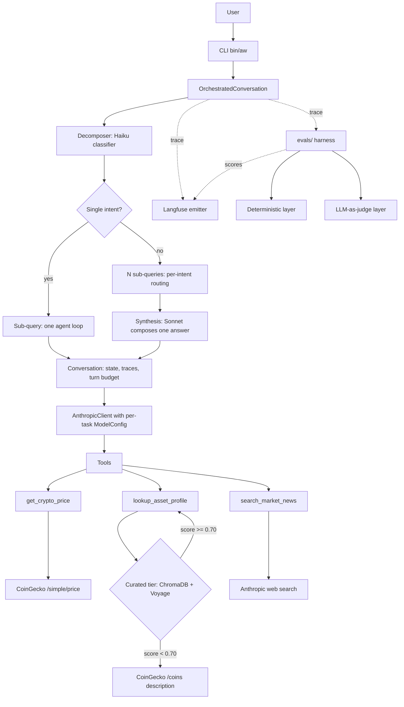

# AW Analysis

Cross-asset market intelligence agent. Ask questions about markets in plain
English; the agent decomposes the query by intent, routes per-intent to the
appropriate model and tools, answers with explicit attribution, and emits a
full observability trace to Langfuse.

Built as a portfolio piece, applying patterns from an 8-module AI Systems
Engineering programme (see [axwxtson/ai-systems-engineering](https://github.com/axwxtson/ai-systems-engineering)).

## Status

**8 stages complete.** Each stage layered in patterns from one study
module, with the eval harness regression-tested on every commit.

| Stage | Module | What it adds |
|-------|--------|--------------|
| 1 | LLM API Engineering | Anthropic SDK wrapper, tool definitions, agent loop |
| 2 | Prompt Engineering | Structured system prompt with versioning, few-shot examples |
| 3 | Agent Architectures | Stateful Conversation with cross-turn memory, structured traces |
| 4 | RAG Systems | Embedding pipeline, vector store, tiered retrieval |
| 5 | LLM Fundamentals | Per-task ModelConfig, token accounting, soft context budget |
| 6 | Evaluation & Testing | Two-layer eval harness with calibrated LLM judge (current) |
| 7 | Multi-Model Orchestration | Query decomposer + per-intent routing (Haiku for price, Sonnet for prose) |
| 8 | Tool Ecosystem & Workflows | Langfuse observability behind a facade; eval scores attach to traces |

Current eval baseline: **23/24** on the v2.3.0 golden dataset
(`evals/results/v2.3.0_<run_id>.json`). The one structural failure
(`combined_btc_price_history`) is a tool-use enforcement gap on
profile-as-history sub-queries, documented as future work.

## What it does today

The agent answers crypto market questions using three retrieval modalities,
choosing dynamically based on the query, with multi-intent compound queries
decomposed and routed per sub-query:

- **`get_crypto_price`** — live price, 24h change, market cap, and volume
  via CoinGecko. Works for any asset CoinGecko tracks.
- **`lookup_asset_profile`** — background information about an asset.
  Tiered retrieval: tries a curated RAG corpus first; falls back to
  CoinGecko's description endpoint when there's no curated profile.
- **`search_market_news`** — recent news via Anthropic's web search tool,
  with inline citations preserved through to the final answer.
- **No tool** — for follow-ups answerable from conversation history,
  or general crypto concepts.

The asset profile tool returns a `source` field in its results
(`"curated"`, `"coingecko"`, or `"none"`), and the agent attributes
provenance accordingly — "from our research" vs. "according to CoinGecko"
— rather than presenting all sources as equivalent.

For compound queries (e.g. "What's BTC trading at and what's the latest
news on it?"), a classifier decomposes the query into single-intent
sub-queries, each routed to the appropriate model (Haiku for
deterministic price calls, Sonnet for prose-heavy profile and news
calls), with a final synthesis pass composing one user-facing answer.

## How we know it works

The agent ships with an automated eval harness in `evals/`. Two layers
grade every case in parallel:

- **Deterministic** — assertions against the per-iteration trace fields
  the agent emits (`was_refusal`, `tool_calls`, iteration count, token
  usage). Fast, reproducible, brittle to paraphrase by design.
- **LLM-as-judge** — faithfulness and relevance scoring of the final
  answer against the tool results captured in the trace. Calibrated
  against a 12-pair human-graded reference set; bias-tested for
  position and length effects.

The judge is calibrated before any eval run gates on its scores. The
calibration pass measures exact agreement, ±1 agreement, direction
agreement, position consistency, and length bias against five
explicit thresholds.

Golden dataset: 24 cases across six query classes (price, profile via
curated retrieval, profile via CoinGecko fallback, news, refusal,
combined-tools). Every case has an explicit rationale.

```bash
# Calibrate the judge (required once per rubric version)
PYTHONPATH=$(pwd) python -m evals.cli calibrate

# Run the full harness against the active prompt
PYTHONPATH=$(pwd) python -m evals.cli run

# Compare two runs (baseline vs candidate)
PYTHONPATH=$(pwd) python -m evals.cli compare \
  evals/results/v2.2.0_.json \
  evals/results/v2.3.0_.json
```

Every eval case also emits a Langfuse trace with deterministic and
judge results attached as Langfuse scores, so per-case grading is
auditable in the dashboard alongside the trace that produced it.

## Observability

Every CLI invocation and every eval case emits an OpenTelemetry-shaped
trace to Langfuse. Every model call is a generation observation with
cost, latency, token counts, and model name; tool calls are spans;
eval grading attaches as Langfuse scores on the same trace the case
ran on.

```bash
# One-time setup
export LANGFUSE_PUBLIC_KEY="pk-lf-..."
export LANGFUSE_SECRET_KEY="sk-lf-..."
export LANGFUSE_HOST="https://cloud.langfuse.com"     # or self-hosted
export LANGFUSE_PROJECT_URL="https://cloud.langfuse.com/project/"
```

When the keys are absent, AW Analysis runs identically but emits no
traces; a single warning is printed to stderr on the first call.
Observability is never on the critical path.

**Architecture**: every emit goes through `aw_analysis.obs.emitter`.
No other module imports `langfuse`. Langfuse is the single framework
adopted by AW Analysis; the rationale is recorded in
`CURSOR_WORKFLOW.md` and the Stage 8 retrospective. See
`LANGFUSE_DASHBOARDS.md` for dashboard configuration.

## Architecture



## Components

 **`aw_analysis/agent/`** — `Conversation` (stateful), `TurnTrace`,
  `ToolCall`, agent loop, error types, `OrchestratedConversation`
  (Stage 7), `Decomposer` (Stage 7)
- **`aw_analysis/client/`** — Anthropic SDK wrapper
- **`aw_analysis/tools/`** — three tools (`get_crypto_price`,
  `lookup_asset_profile`, `search_market_news`) with schemas, descriptions,
  and structured `ToolResult` returns; `default_registry()` constructs
  the standard registry used by both the CLI and the eval harness
- **`aw_analysis/data_sources/`** — plain HTTP clients (CoinGecko)
- **`aw_analysis/rag/`** — chunker (per-section markdown), embedder
  (Voyage AI, asymmetric query/document), vector store (ChromaDB,
  cosine), retriever, ingest pipeline
- **`aw_analysis/prompts/`** — six-section system prompt, version
  registry (v2.3.0 active), few-shot examples
- **`aw_analysis/obs/`** — Langfuse emitter facade; no other module
  imports `langfuse` directly
- **`data/asset_profiles/`** — 10 hand-written markdown profiles
  (one per researched asset)
- **`data/chroma/`** — generated vector store (gitignored)
- **`bin/aw`** — shell wrapper invoking `python -m aw_analysis.cli.main`
- **`aw_analysis/config/`** — runtime settings, per-task `ModelConfig`
  with measured temperature/max-token defaults, `TaskType` enum
- **`evals/`** — automated eval harness (golden dataset, two-layer
  grader, judge calibration, A/B regression); attaches scores to
  Langfuse traces

## Setup

```bash
git clone https://github.com/axwxtson/AWAnalysis.git
cd AWAnalysis
python3 -m venv .venv
source .venv/bin/activate
pip install -e .

# Configure environment
cp .env.example .env
# Edit .env to set:
#   ANTHROPIC_API_KEY    (required)
#   VOYAGE_API_KEY       (required for the curated RAG tier)
#   LANGFUSE_PUBLIC_KEY  (optional; enables observability)
#   LANGFUSE_SECRET_KEY  (optional; enables observability)
#   LANGFUSE_HOST        (optional; defaults to Langfuse Cloud)

# Symlink the runner script into the venv
ln -s "$(pwd)/bin/aw" .venv/bin/aw

# Build the vector store from the asset profile corpus
python -m aw_analysis.rag.ingest
```

If `VOYAGE_API_KEY` is not set, the agent still runs — the curated tier
silently disables and asset profile queries fall through to the CoinGecko
description endpoint. If `LANGFUSE_*` keys are not set, the agent still
runs — observability is disabled with a single stderr warning on first
call, and the codebase otherwise behaves identically.

## Usage

```bash
# One-shot
aw "What's the current price of BTC?"

# Interactive (REPL with cross-turn memory)
aw
```

In the REPL, `reset` clears history; `exit` quits. Each response shows a
short tool activity line indicating which tools fired and how long they took,
plus the per-iteration model routing (e.g.
`cfg=intent_classification→tool_selection→final_synthesis`).

## Example session
```text
you ❯ What is Quant?
tools: ✓ lookup_asset_profile (1496ms) | cost: $0.014 | cfg=intent_classification→tool_selection→final_synthesis
Quant (QNT) is a London-based blockchain infrastructure project...
According to CoinGecko, Quant developed Overledger...
Need current price or market data for QNT?

you ❯ Yes, what's the price?
tools: ✓ get_crypto_price (505ms) | cost: $0.005 | cfg=intent_classification→tool_selection→final_synthesis
QNT is at $70.48 (+3.62% in 24h).
Market cap: $1.02B. Volume (24h): $12.6M.
```

The first turn falls back to CoinGecko (no curated QNT profile); the
second turn resolves the price for an asset outside the curated ticker
map by going through CoinGecko's search endpoint. The Stage 7 routing
sends the price call through Haiku (cheaper, sufficient for a
deterministic tool call) and the profile call through Sonnet.

## Design notes

**Why `lookup_asset_profile` and not just CoinGecko everywhere?**
The curated corpus carries editorial framing (cross-asset comparisons,
notable historical context, opinionated takes) that CoinGecko's
descriptions don't. For researched assets, retrieval scores cleanly
above 0.70 against the corpus; for the long tail, the CoinGecko
fallback ensures we never silently fail.

**Why ChromaDB and not pgvector?** ChromaDB runs in-process with no
server, suitable for a portfolio project and keeping the data flow
inspectable. pgvector becomes the right answer once persistence and
multi-process access matter; the `Retriever` interface is decoupled
from the store, so swapping is a one-file change.

**Why Voyage AI for embeddings?** Voyage's `voyage-3` model supports
asymmetric query/document embeddings — using `input_type="document"`
at storage time and `input_type="query"` at retrieval time produces
measurably better matches. This is one of the things that distinguishes
a well-built RAG from a naïve one.

**Why structured `ToolResult` returns?** A bare-string return makes it
hard for the agent loop to distinguish success from failure. The
`ToolResult` dataclass carries `success`, `duration_ms`, and an
`error` category alongside the content. This pays off in the eval
stage (assertions on traces) and the observability stage (Langfuse
tagging by error type).

**Why two grader layers instead of one?** Substring matching is cheap
and reproducible but misses paraphrases ("can't provide personalised
advice" vs "cannot give financial advice"). LLM-as-judge is semantically
robust but noisy and expensive. We report both and treat disagreement
as a signal worth investigating — that pattern catches more genuine
issues than either layer alone, especially on refusal grading where
the surface form varies.

**Why calibrate the judge?** Because LLM judges have biases — position
bias when comparing pairs, length bias when scoring single answers,
self-preference when grading their own family. The calibration pass
measures all three against a small human-graded reference set and
refuses to gate downstream eval results until the judge agrees with
human grades within ±1 at least 80% of the time. Skipping this step
is trusting a random number generator.

**Why a query decomposer instead of stacking system-prompt rules?**
Prompt engineering has a ceiling for behavioural constraints —
specifically, getting one agent turn to commit to multiple tool calls
in a compound query. Stage 6 hit that ceiling; Stage 7's structural
fix (a Haiku classifier that splits the query into single-intent
sub-queries before the agent ever sees them) is more reliable than
any wording change to the system prompt.

**Why per-intent routing instead of always-Sonnet?** Price sub-queries
are deterministic tool calls; Haiku at temp 0.2 is sufficient and
~3× cheaper. Profile and news sub-queries need prose quality and
benefit from Sonnet. The routing override lives in
`OrchestratedConversation`, not in `MODEL_CONFIG_REGISTRY`, so the
decision is localised and the wrapped `Conversation` class stays
unaware of routing.

**Why Langfuse and no other framework?** Standalone observability is
hard to reproduce — OTEL semantic conventions, batch span export, a
UI, per-attribute aggregation — and the existing trace shape maps onto
Langfuse's data model without architectural compromise. Adoption is
non-invasive (a single facade module; the SDK is OTEL-native so
fallback is shallow), and the dashboards work for the slices the
Stage 6 and Stage 7 retrospectives kept reaching for: cost and latency
by prompt version, query class, and sub-query intent. LangChain,
LangGraph, Pydantic AI, and LiteLLM stay as reading — they fail one
or more of the six criteria the framework survey applied.

## License

MIT.

## Notes

- **Why a shell wrapper and not a Python console script?**
  On Python 3.14, editable installs no longer honour `.pth` files when
  entry-point scripts are run via their shebangs, which can result in
  `ModuleNotFoundError`. The shell wrapper (`bin/aw`) uses `python -m`
  to launch the CLI, ensuring `sys.path` is initialised correctly so
  the `aw_analysis` package is always found.